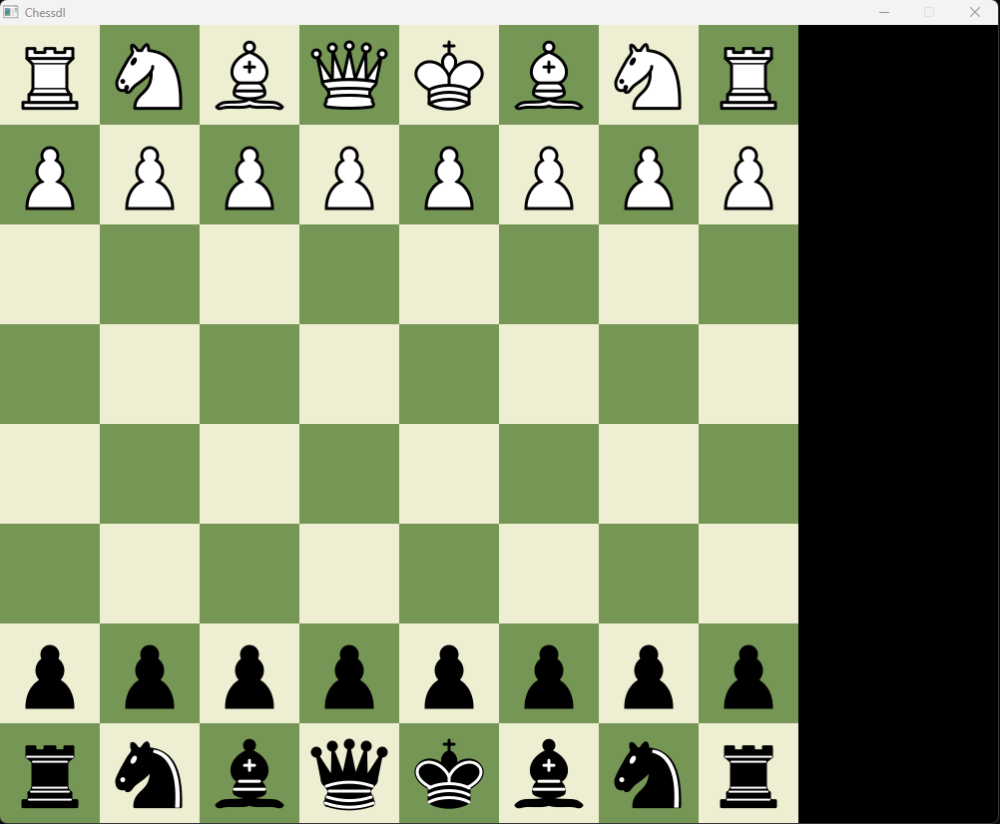

# Chessdl
A simple chess game implementation in C++ with SDL2. Still in development.

Piece images are taken from https://en.wikipedia.org/wiki/Chess_piece#/media/File:Chess_ndt45.svg  
They are licensed under CC BY-SA 3.0 license (https://creativecommons.org/licenses/by-sa/3.0/).
